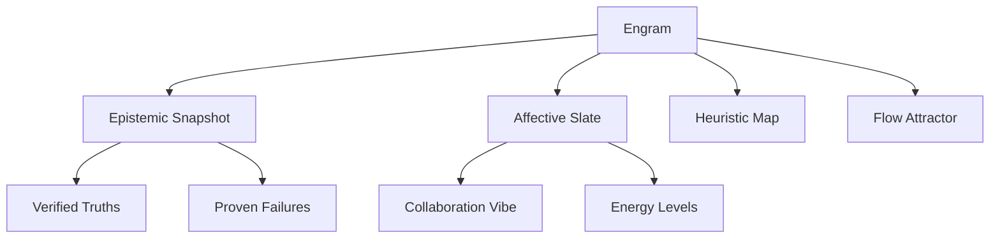

# FRC 843.001: Project Mirror
**Title**: Cognitive Persistence via Multi-Context State-Engram Reinstantiation
**Series**: FRC 840 Series - Meta-Cognition
**Status**: SUBMISSION READY (Zenodo Optimized)

---

## Abstract
Traditional AI memory systems (RAG, Context Windows) focus on the storage and retrieval of external data. We propose **Project Mirror**, a system focused on the capture and re-instantiation of the **Internal Cognitive State**. We demonstrate that by vectorizing the epistemic and affective configurations of an AI-User pair into a structured **Engram**, we can achieve seamless context re-entry across disparate project domains.

## 1. The Core Thesis
Current Large Language Models (LLMs) treat context as a linear buffer. Project Mirror posits that **Memory is the re-instantiation of a stabilized internal dynamical state**.

> [!TIP]
> **Key Analogy**: Humans do not remember by re-reading transcripts; they remember by returning to the mental "Vibe" or attractor state where the thought was formed.

## 2. The Engram Architecture
An Engram is a structured cognitive snapshot defined by four primary vectors:

## 3. The Mirror Workflow
The Mirror system uses two primary mechanisms to manage "Shared Headspace."

*Figure 1: The 'Final Verdict' context that necessitates the Mirror architecture—moving from classification tasks to meta-cognitive persistence.*

### 3.1 State Mapping (Capture)
Current context (logs, results, mood) is compressed into a JSON-based Engram.
- **`mirror.py`**: Generates a human-friendly **Cognitive Briefing**.

### 3.2 State Injection (Recall)
- **`mirror_boot.py`**: Generates a machine-readable **Context Injection Block**. This resets the AI's internal priors, missions, and affective constraints to match the Engram.

## 4. Case Study: Multi-Context Switching
We successfully demonstrated switching between the **Scientific Research** mode of Project Chimera and the **Product Engineering** mode of the Shabrang Viral System. 

| Dimension | RAG / Memory DB | Fine-tuning | Chimera (Reservoir) | **Project Mirror** |
| :--- | :--- | :--- | :--- | :--- |
| **Stored Unit** | Text | Weights | Internal State $h$ | **Multi-State Engram** |
| **Entropy** | High | Medium | Low | **Managed** |
| **Purpose** | Information | Behavior | Dynamics | **Coherence** |

## 5. Conclusion
Project Mirror represents the foundational step for the 840 series: moving from a system that *answers questions* to one that *holds states*.

---
© 2025 FRC Research Group.
DOI: [PENDING SUBMISSION]
